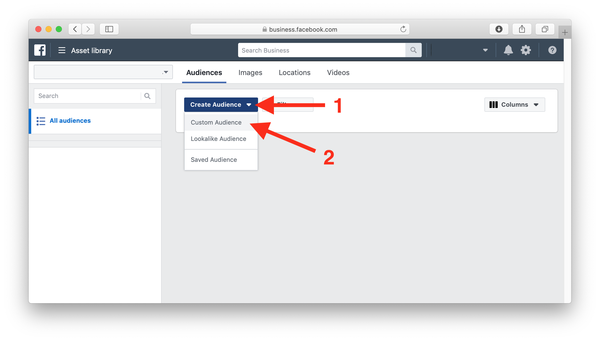

# Facebook Pixel

## Facebook Pixel Support

With the Facebook Pixel integration you can create Custom Audiences that can be used to target your Facebook Ads based on the visitors of your [moin.link](https://moin.link) landing page.

An audience can be defined as 

* a simple `All website visitors`
* a more refined `Every visitor who clicked on Spotify or Deezer` 
* or even `Every visitor without any link click` \(aka bouncer\).

Here's a step-by-step guide explaining the setup process end-to-end

## 1. Setup

### 1.1 Create Facebook Pixel

1. Log into the [Facebook Business Manager](https://business.facebook.com)
2. Click on the `≡ Business Manager` button
3. Click on `All tools`
4. Click on  `Manage business > Events Manager`

1. Click on `+ Add New Data Source`
2. Click on `Facebook pixel`

1. Pick a name and leave the `Website URL` empty
2. Hit `Create`

### 1.2 Copy Pixel Code

Select `Manually install pixel code yourself`

Click on the code to copy it

### 1.3 Integrate Facebook Pixel

1. Log into your [moin.link](https://moin.link) page and open the menu by hovering over the moin.link logo in top left corner
2. Click on `Tracking Pixels`
3. Click on `Facebook`
4. Paste the Pixel Code into the Textbox
5. Hit `Add`

Now your pixel is installed!

### 1.4 Choose Your Cookie Consent

The Facebook Pixel can only be served to visitors who have given their explicit consent. By default this consent is shown:

#### 1.4.1 Default

Once the visitor hits accept, the Facebook Pixel is served and this user can be part of a Custom Audience. The visitor can decide to ignore the consent or to disallow the usage of the Facebook Pixel. In this case your Pixel Code won't be served to the visitor.

#### 1.4.2 Force Visitor Decision

Alternatively you can force the visitor to make a decision, hopefully by hitting `ACCEPT`. Using this kind of consent your Facebook Pixel is more likely to be served. 

## 2. Retargeting \(aka Remarketing\)

The pixel triggers different events for different visitor actions. You can create audiences based on those events. To create an audience go to the [Facebook Business Manager](https://business.facebook.com) and navigate to `Menu > All tools > Advertise > Audiences`:

1. Click on `Create Audience`
2. Click on `Custom Audience`

Choose `Website traffic`:

Now you have different options depending on what kind of visitors you want to target:

### 2.1 All Visitors

The most basic audience targets every visitor of your moin.link page:

1. Select your pixel
2. Pick `All website visitors`
3. Name your audience
4. Hit `Create Audience`

### 2.2 Visitors who have clicked a certain link

You can also target visitors who have clicked on a certain link, e.g. Spotify

> Please wait a few days after integrating your pixel. Otherwise Facebook won't know about the different possible events from your landing page and you won't be able to select them.

1. Pick `Outlink` \(instead of `All website visitors`\)
2. Click on `Refine by`
3. Choose `URL/Parameter`
4. Select `label`
5. Choose a service name, e.g. `spotify`
6. Name your audience
7. Hit `Create Audience`

### 2.3 Visitors without any link clicks aka bouncers

It is also possible to target everyone who hasn't clicked on any link. This is an important audience as in todays busy life we tend to get distracted and forget to finish an intention. Now you can reengage with those visitors too!

Just choose `Bounce` as the pixel criteria \(instead of `All website visitors`\):

## 3. Possible filter criteria

The parameter action contains the type of link the visitor clicked on, possible values are:

* Stream
* Download
* Vinyl
* Live
* Artist

The parameter label contains the actual link target, possible values are:

* spotify
* itunes
* bandcamp
* ...

and many more! Here's a way how you can figure out the right parameters yourself:

In the [Facebook Business Manager](https://business.facebook.com) select your pixel on the `Manage business > Events Manager` page:

Here you see all the possible actions \(PageView, Outlink, Bounce\) that have already happend on your landing page. To learn more about possible labels, click on `View details`:

Select the `Activity` tab and hover the `Parameters` column to see more details:

If you think some label is missing here, just click the corresponding link on your landing page by yourself and it will appear here shortly.

